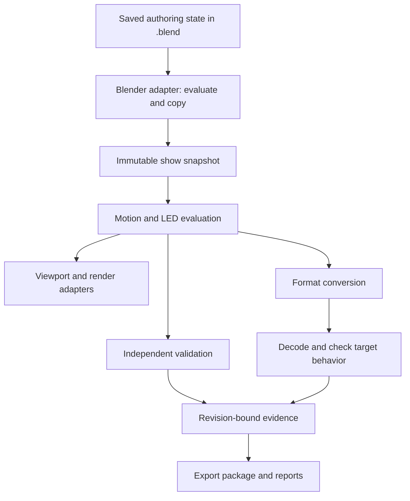

# Architecture

This is the proposed architecture, not the current implementation. Introduce each
boundary when its first real use appears. Avoid empty abstractions and a large
package reorganization before there is behavior to move.

## Independent implementation and local computation

Sirius owns its authoring model, Blender integration, and computational core. The
selected direction is to evolve this repository rather than fork Skybrush's
frontend. A future Skybrush adapter belongs at an external boundary and must not
define the internal model or require a commercial backend for essential functions.

Start the computational core as an ordinary local Python library. Its inputs and
results contain plain data, with no Blender object references. It can run in tests
without Blender and can later run in a worker process without changing the meaning
of a show. HTTP, hosted services, and a separate server are not initial requirements.

Targeting modern Blender simplifies integration choices; numerical speed still
depends on algorithms and data representation. Measure scene evaluation, copying,
computation, validation, and encoding separately. Follow the
[evaluation plan](performance-and-evaluation.md) before changing an implementation
for speed. Mature open-source dependencies remain an option after their contracts
and deployment costs are understood.

## One source of authoring truth

The saved `.blend` is the editable project. Sirius-owned properties, object
references, native animation, cues, and asset references describe author intent.
The adapter evaluates that intent into an immutable, Blender-independent snapshot
for a particular revision and time range. Numerical functions operate on that
snapshot; generated geometry and caches are derived results.

This avoids maintaining a mutable Python `Show` object and a mutable Blender
scene as competing authorities. A snapshot cannot silently write back into the
authoring state. Applying a planned change is an explicit, undoable operation.
An interchange export is a documented representation of a revision, not a second
background editor of the `.blend`.

Viewport display may be reduced or cached. Full evaluation, validation, and export
must use the complete requested drone set and time range. A stale cache is never
evidence for a current export.

## Responsibilities and dependency direction

| Boundary | Responsibility | Blender dependencies? |
| --- | --- | --- |
| `core/` | Identities, time/units, immutable values, schema and evaluation contracts | No `bpy`, `mathutils`, `gpu`, or UI imports |
| `algorithms/` | Sampling, matching, motion, light fields, geometric/numerical checks | Plain data only; numerical dependencies must be explicit |
| `exporters/` | Target capabilities, conversion, encoding, package metadata | No Blender types; consume snapshots/evaluated data |
| Future `importers/` | Defensive parsing and reconstruction of documented formats | No Blender types; no implicit code execution |
| `blender/` | Registration, saved state, evaluated scene access, generated data, jobs, version adapters | Yes |
| `operators/`, `panels/`, `props.py`, `materials/` | Existing Blender-facing authoring and presentation | Yes; gradually move responsibilities when useful |
| Future reporting/preview modules | Numerical report data in core; display and render setup in adapter | Only the presentation side |

The pure layers must not import the adapter, including indirectly through package
initialization. Unit tests import the real pure modules; replacing `bpy` with a
permissive fake everywhere would conceal this boundary problem.

Keep operators short enough to explain: gather input, request work, apply a
result, report failure. UI drawing does not generate formations or run solvers.
Do not create a plugin framework until two working adapters or effects reveal a
useful common contract.

## Concepts, introduced in order

| Concept | Meaning | First needed |
| --- | --- | --- |
| Show document | Identity, schema, timebase, units, owned entities and references | M1 |
| Drone identity | Persistent logical performer, independent of name/storage order | M1 |
| Fleet profile | Motion, uncertainty, payload and operational assumptions, with revision | Minimal at M1; full at M5 |
| Formation and slot | Source intent plus generated target positions; slots are not drone IDs | M3–M4 |
| Group | Named membership/selection rule with defined update behavior | M2–M4 |
| Cue | A timed request for a subset of drones; defines motion/light ownership | M3–M4 |
| Transition | Assignment, trajectory family, timing, locks, solver settings and result | M5 |
| Effect and mask | Time, target group, field, color source, opacity and blend behavior | M2 |
| Site profile | Coordinate anchor, orientation, datum, boundaries, obstacles and zones | M4–M6 |
| Device mapping | Logical drone to physical vehicle/home/payload mapping | M7 |
| Validation report | Checks and coverage against a specific evaluated revision/profile | M3 diagnostics; M6 full report |
| Export profile | Target/version, capabilities, conversion and permitted losses | M3/M7 |

Each field needs an owner, units, default/unknown behavior, and a persistence
rule. Prefer a few explicit values to a generic property bag with undocumented
meaning. Do not add a payload hierarchy before the first supported payload needs it.

## Identity and ownership

Allocate persistent logical IDs. Store and carry them through evaluation,
instancing, assignment, rendering, and export. Maintain explicit mappings between
IDs, storage positions, formation slots, and hardware IDs. A point index may be a
temporary lookup optimization, never the identity contract.

Specify policies for duplicate objects, copied scenes, regenerated formations,
linked assets, removed drones, spare vehicles, and partial shows. Detect duplicate
or missing IDs rather than silently reallocating them during export. A geometric
operation that drops or merges required identity attributes is unsupported until
the adapter can preserve or reconstruct the mapping unambiguously.

Tag generated collections, materials, node groups, and objects with ownership.
Update or remove only the data owned by the relevant show or preview. Names are
editable labels. Multiple scenes and multiple Sirius shows must not collide through
global names such as `Drones` or `Scene.my_props`.

## Time, space, and color contracts

**Time.** Use explicit show-relative seconds at numerical boundaries. Store the
scene frame origin and exact `fps / fps_base` relationship. Define interval ends,
subframes, preroll, audio offset, retiming, and the final sample. Position and LED
rates can differ. Output timestamps come from the time contract, not incremental
floating-point addition or a hidden assumption of 24 fps.

**Space.** Use meters and a named right-handed, Z-up local show frame. Blender
world positions must be converted through the show anchor and scene-unit policy;
raw local object coordinates are insufficient. A local Y direction is not
automatically geographic north. Georeferencing records origin, orientation,
horizontal CRS, altitude datum, and precision assumptions. Preserve orientation
and heading conventions at every adapter boundary.

**Color.** Begin with an explicitly named linear RGB working space and a separate
normalized intensity. Define the chosen primaries/conversion in the first schema;
do not label unspecified channels merely “linear.” Convert imported sRGB images
once, compose at useful precision, and apply the device's documented channel
encoding/calibration only at its output boundary. RGBW requires a defined white
channel model. Rendering converts light output into a visual appearance; exposure,
glare, and display transforms do not alter exported LED commands.

Reject non-finite values and dimensionally invalid input early. Keep uncertainty
and numerical tolerance separate from a physical safety margin.

## Authoring and evaluation

Use native keyframes for supported object and effect controls. Read the evaluated
dependency graph for constraints, modifiers, and animated transforms. Copy needed
data into ordinary values; do not retain ephemeral evaluated Blender objects in
long-lived caches or workers.

A snapshot does not reproduce Blender's entire dependency graph. For native
animation or modifiers that the pure evaluator cannot reproduce, the adapter
samples Blender or supplies a verified equivalent segment model with a stated
approximation bound. Those evaluations stay in Blender. Interchange round trips
preserve the declared evaluated tracks; they do not promise reconstruction of
every original modifier, constraint, or authoring effect. Keep the `.blend` and
its assets for that purpose.

Generated per-frame colors/positions must not overwrite authored keyframes or
parameters. A designer's manual trajectory edit becomes explicit authoring input,
invalidates dependent results, and remains subject to validation. Baked results
carry their source revision and can be regenerated without losing authored input.

For any requested time, evaluate from the same authoring revision and explicit
inputs. Results must not depend on whether the user played from the beginning,
scrubbed backward, or rendered frames out of order. Seed random effects from
stored seeds and stable identity/time rules. Stateful simulations need an explicit
bake before arbitrary-time export or render.

Native Actions/NLA can carry animation. Show cues must still define ownership,
overlap, retiming, and group behavior. Test that interaction before committing to
an NLA-only show editor. Blender's
[Action API changed across 4.4 and 5.0](https://developer.blender.org/docs/release_notes/5.0/python_api/).

## Persistence and revision tracking

Persist authored parameters, schema versions, IDs, asset provenance, and references.
Use stable references where Blender supports them and an explicit resolution
policy for external files. Pack or relocate eligible assets through a deliberate
bundle operation; include licenses and missing-file diagnostics.

Caches record the schema, evaluator version, relevant inputs, and source revision.
Changes to geometry, modifiers, animation, cues, masks, media, units, frame rate,
profiles, and origin must invalidate the affected outputs. Start conservatively
with broad invalidation; optimize only after tests prove dependency coverage.

An export/report fingerprint covers all safety-relevant inputs and the evaluated
result, including external media/profile content hashes. A file's modification
time alone is insufficient. Record nondeterministic/environmental inputs explicitly.

Migrations run on copies or provide a recoverable backup. Preserve an older file
until the migrated result has been checked. Unsupported future schemas must not
be silently opened and rewritten as older data. Save/load, undo/redo, duplication,
append/link, and asset relocation need separate tests.

## Jobs and Blender lifecycle

Keep scene reads/writes in the Blender-controlled execution path. A worker may
receive copied numerical data; it must not hold or access `bpy` state. Consider
process isolation for expensive pure work only when measurements justify it.
Do not introduce background Python threads that mutate Blender data.

Handlers should schedule/invalidate small amounts of work and avoid recursive
updates. A property message subscription is not a complete notification system for
animation or dependency-graph changes. Own and remove subscriptions, timers,
handlers, and draw callbacks on disable/load. Handle failed registration cleanly.

Blender warns that [handler mutations during rendering can race with viewport
access](https://docs.blender.org/api/5.2/bpy.app.handlers.html). Prove the chosen
evaluation/update strategy in viewport, background render, and out-of-order frame
tests. Expensive validation must not run synchronously on every dependency update.

All long jobs need progress, cancellation, an immutable input revision, bounded
resource use, and cleanup. Restore user state on success and failure. Reject a
computed result if its inputs changed while the job ran.

## Representation and performance

Shared mesh objects are a reasonable first representation for small shows and
native selection. Mesh points or point clouds with instanced proxies may reduce
overhead at scale. Measure both; a render-efficient representation may be awkward
to author or sample correctly.

Evaluate bulk attribute movement, object/material counts, instance IDs, culling,
selection, and color rendering. No representation is accepted solely because it
contains fewer objects. Keep identity and numerical output stable when replacing it.

Dense matching, pairwise checks, and all-frame storage can dominate memory at
large counts. Record their complexity and measure worst cases. Spatial indices
reduce candidate work but do not replace exact checks; dense neighborhoods may
remain expensive. Use bounded chunks for long validation and export jobs.

## Compatibility and dependencies

Target Blender 5.2 LTS first. Keep version-specific integration in small adapters
and test actual behavior. Use capability checks when appropriate, with explicit
errors when a required capability is absent. Do not mask failures with broad
exception handling and a silent fallback.

Record Blender's bundled Python version in the support matrix. The developer's
virtual environment is for tools/tests and is not automatically the runtime used
by Blender. Any binary dependency needs wheels or a build/distribution plan for
every supported Python ABI, OS, and architecture.

Start with understandable reference implementations and small correctness oracles.
If a production solver/library becomes necessary, make its version, license,
numerical behavior, and packaging explicit. Installing SciPy on one developer's
machine must not silently change the algorithm or supported capacity of a release.

The architecture remains open to revision through the
[decision register](decisions.md), supported by a concrete experiment.
