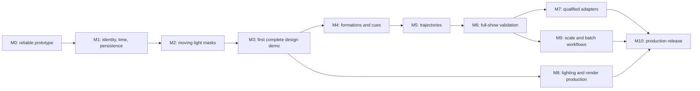

# Sirius project plan

Revision: September 18, 2026. Starting point: commit `61f04a0`.
This replaces the previous roadmap. It specifies intended behavior and release
evidence; it does not describe completed features.

## Product goal

Build an open-source Blender extension that a drone-show team can use from
creative brief through production handoff: formations, choreography, lighting,
site planning, previews, constraint checking, and export. Authoring, computation,
validation, and documented exporters should run locally without a required
account, proprietary solver service, or drone-count license tier.

Sirius will develop its own Blender frontend and computational core from the
existing prototype. Reusing Skybrush's frontend is not the selected starting
point. The core begins as a local library independent of Blender; a server or
separate worker is introduced only when a demonstrated requirement justifies it.
Open-source libraries may be used after their behavior, license, and distribution
requirements are understood. Interoperability must not make a proprietary service
necessary to complete Sirius's own authoring, validation, or export workflow.

The first distinctive workflow is lighting: a designer moves an invisible mask
through a formation, layers color effects, aligns them with music, and gets the
same evaluated light program in the viewport, renders, and exported data. The
second is previewing: a designer can render a frame or full show without manually
rebuilding the scene's lighting and compositor for every project.

Current Skybrush already documents moving mesh masks and modern Blender support.
Sirius therefore needs to earn a preference through usability, dependable
interchange, and a complete open implementation. See the
[research baseline](docs/research.md). Professional adoption also depends on
reliability, receiver compatibility, documentation, maintenance, and operator
feedback. A feature checklist alone cannot establish that a company will switch.

## How improvement will be demonstrated

The aim is a preferred production tool, with evidence for each claimed advantage.
Use the [performance and workflow evaluation plan](docs/performance-and-evaluation.md)
to compare specific tasks with current Skybrush, including its licensed backend
when that capability is needed. A community service limit is not a performance
result. Record unavailable comparisons without inventing a winner.

Establish small baselines during M1–M3. Measure solver quality and failure behavior
at M5–M6, fidelity at M7–M8, and scale at M9. Use external designer and operator
evaluations for M10. Correctness, output fidelity, and recoverable editing remain
release requirements during optimization. Choose a supported workload and state
its limits; no release promises the fastest implementation for every possible show.

## Scope and release levels

The extension prepares shows and production artifacts. Ground control, vehicle
firmware, radio links, live emergency handling, and regulatory approval belong to
separate systems. Sirius must expose the information those systems need and
document the boundary. Future payload or live-control integrations require their
own design and qualification; they are not implied by a working position export.

| Level | Required result | What may be claimed |
| --- | --- | --- |
| Current prototype | Existing grid and static material controls | Source-level prototype only |
| Design demonstrator, M0–M3 | Small saved show, mask lighting, frame/full-show preview, documented interchange | Useful for learning and visual design; no flight qualification |
| Authoring alpha, M0–M6 | Formation/cue workflow, trajectories, independent analysis, recoverable editing | Can author and analyze within explicitly supported assumptions |
| Interoperability beta, plus M7 | At least one qualified execution-toolchain adapter and one visualization adapter | Compatibility only with the tested receiver versions and profiles |
| Production candidate, M0–M10 | Release evidence, scale tests, repeatable handoff, external evaluations | Suitable for evaluation in the documented workflow |
| Production release | Candidate gates plus qualified operator acceptance for its intended use | Versioned support statement with known limitations |

No dates are assigned before throughput and difficult research tasks are known.
The large-company target is a sustained product program, not the first release.
Finish small, usable slices and revise the plan from evidence.

## Development order

The branches express technical dependencies. A solo developer should still keep
one implementation task active. Research on receiver formats and designer needs
can begin early without building their adapters early.

Read [architecture](docs/architecture.md) for data ownership,
[lighting and preview](docs/lighting-and-preview.md) for detailed interactions,
and [validation and export](docs/validation-and-export.md) for correctness gates.
Use [performance and evaluation](docs/performance-and-evaluation.md) for benchmark
fixtures, comparison conditions, and measured acceptance criteria.
The [decision register](docs/decisions.md) separates recommendations from choices
that still require an experiment or maintainer decision.

## M0 — Establish a reliable development baseline

**Outcome:** understand and install the existing prototype, then make its small
set of operations predictable on the chosen Blender build.

**Starting files:** `__init__.py`, `blender/registry.py`, `props.py`,
`operators/create_takeoff_grid.py`, `operators/change_led_color.py`,
`materials/drone_emission_material.py`, `blender_manifest.toml`.

Work in separate changes:

1. Trace the entry point, registration, grid creation, and material creation.
   Reproduce current behavior in a disposable file and record the exact Blender
   build, traceback, and scene changes. Preserve the registry already written.
2. Make grid creation preserve unrelated scene state. Treat preview setup as a
   separate operation. Address Blender API failures in that operation's scope.
3. Handle insufficient capacity, missing collections/materials, empty selection,
   and repeated creation. Define cancellation, undo/redo, and partial-failure
   behavior before adding more UI controls.
4. Establish a repeatable extension package and install procedure using reviewed
   source files. Exclude caches, virtual environments, personal notes, and client
   assets. Resolve the distribution-license decision before a public platform
   submission. Do not change the license merely to silence a packaging error.
5. Add the first meaningful regression tests and a minimal test runner. Make it
   possible to import pure modules without the package importing `bpy` first.
   Keep ordinary Python tests separate from Blender integration tests.
6. Remove tracked bytecode. Record a clean install/enable/disable/re-enable test.
   Align the manifest and README with actual tested versions, initially 5.2 LTS.

**Learning:** imports, side effects, resource ownership, exceptions, small tests,
and Blender's registration/undo lifecycle.

**Exit evidence:** a saved reproduction and verification record; no destructive
compositor edits during grid creation; meaningful error behavior; an installable
development package with an inspected file list. No compatibility claim for a
build that was not exercised. Verify file-system behavior in a disposable folder.

## M1 — Give a show identity, time, and persistence

**Depends on:** M0. **Outcome:** a small show remains the same show after renaming,
reordering, undo, and reopening the file.

Start with the minimum data needed by one grid and one light effect:

- Show identity and schema version; drone identities; namespaced ownership of
  generated Blender data; explicit membership in the current show.
- A distinction between a drone, a formation slot, its home position, and an
  external hardware assignment. Do not equate identity with point index or name.
- Show time in seconds; an explicit frame origin and rational frame rate; units
  and coordinate conventions. Scene scale, subframes, and non-24 fps must work.
- Saved authoring data and asset references in the `.blend`; transient numerical
  snapshots for computation; derived caches that can be discarded and rebuilt.
- Schema migration policy, duplicate-ID detection, and clear handling of missing
  objects or assets. A copied show needs a deliberate identity policy.
- A small pure-Python evaluator contract and tests for invalid/non-finite data,
  duplicate IDs, time conversion, and save/load equivalence through the adapter.

Keep the current object-based representation until a small experiment compares
shared meshes/materials, a mesh with point attributes, and a native point cloud.
Test selection, per-drone color, evaluated positions, and persistence as well as
speed. M9 makes the final scale decision from benchmarks.
Record the first 64- and 1,000-drone fixture definitions, reference hardware, and
creation/evaluation/memory measurements before changing representation. Expand
these fixtures as real features arrive; they are not a separate framework project.

**Learning:** data modeling, invariants, ownership, serialization, and boundaries.

**Exit evidence:** a 16-drone project survives rename/reorder/save/reopen without
changing the ID-to-position mapping. Ordinary Python can exercise its numerical
model without launching Blender. Unit and time conversions have hand-computed
examples. A failed load or migration does not overwrite the original file.

## M2 — Build the first moving light mask

**Depends on:** M1. **Outcome:** sweeping a hidden sphere through a small static
formation changes its LEDs predictably while scrubbing in either direction.

Implement one small feature at a time:

1. A base LED color/intensity program with group and selection targeting.
2. A spherical mask evaluated in its own coordinate system, with a visible
   authoring guide and no geometry in the final render.
3. Start/end times and a fade, then a second layer with defined ordering and
   opacity. Add mute, solo, and an inspection readout for one drone.
4. A deterministic evaluation path shared by viewport and data sampling. Scrub
   directly to a frame and obtain the same result as sequential playback.
5. An explicit boundary between artistic color, device LED output, and rendered
   light appearance. Brightening the camera preview must not change the show.

Do not start with arbitrary mesh containment, a custom node editor, or thousands
of per-drone color keys. Add those capabilities after the small behavior is clear.

**Learning:** coordinate spaces, scalar fields, interpolation, pure functions,
and composition. Use the short readings in [research](docs/research.md#learning-references).

**Exit evidence:** a 16–64 drone demonstration, boundary cases for mask membership,
two overlapping effects with predictable order, and matching sampled colors after
save/reopen. Moving, rotating, and scaling the mask follows its documented rules.

## M3 — Complete a small design demonstrator

**Depends on:** M2. **Outcome:** a short show can be designed, saved, reviewed,
rendered, and exported as documented interchange.

- Author two simple formations and a manually specified transition. Automatic
  path planning is not a prerequisite for this demonstrator.
- Use one show timeline with holds, motion, LED cues, and a music reference.
  Start with Blender markers and a clear cue list; make retiming explicit.
- Define the first version of Sirius JSON and CSV: units, timestamps, identities,
  color encoding, interpolation, ordering, and schema version. Implement a small
  reader to check semantic round trips, with deliberately independent fixtures.
- Provide basic sampled spacing/speed diagnostics, labeled with their limited
  coverage. Report invalid samples and missing data. Do not attach a full-show
  safety claim to these early checks.
- Add a preview operation for the current frame and a selected/full show range.
  Supply a camera and conservative LED appearance defaults in a separate preview
  scene or an explicitly owned setup. Preserve the authoring scene.
- Render an image sequence, make a review video where the build supports it, and
  restore frame, selection, and render state after completion or cancellation.

**Learning:** end-to-end data flow, file contracts, evaluation at arbitrary times,
and integration testing.

**Exit evidence:** a reproducible 30-second, 32–64 drone example containing two
formations, one moving mask, a cue, a still image, a full-range preview, and a
readable interchange export. A fresh session can reopen and reproduce it. This
is the first design demonstrator, not an execution package.
Record the designer steps and elapsed time for a mask edit, cue retime, and preview
setup. Compare the same tasks with current Skybrush where available and retain
the files and versions so later improvements can be measured.

## M4 — Make formation and cue authoring practical

**Depends on:** M3. **Outcome:** a designer can build and revise a multi-scene show
without manually managing every drone.

- Formation sources: line/circle/grid, curves, text and SVG/logo outlines, then
  mesh surfaces and volumes. Support evaluated modifiers and animated sources.
- Exact requested counts, deterministic seeds, minimum spacing, edge/corner
  preservation, density weights, and group allocation. Report infeasible count
  and spacing requests rather than silently changing either.
- Separate fixed slots from regenerated samples. Explain when source edits
  invalidate assignments. Preview before replacing generated data.
- Cue list with holds, transitions, overlaps, named groups, relative LED cues,
  insert/move/duplicate/ripple operations, and duration changes. Prevent two cues
  from owning the same drone's motion ambiguously.
- Reserve/overflow groups, partial formations, manual slot locks, reusable
  formation assets, and import of documented coordinate/trajectory data.
- Audience cameras, readability checks, dimensions, and a site-layout overlay.
  Handle text/QR density honestly: assess readability at a stated viewpoint and
  distance instead of promising every source shape will work.

**Learning:** geometric sampling, constrained allocation, dependency tracking,
and interaction design. Prototype native Action/NLA integration before promising
it as the whole show editor.

**Exit evidence:** a representative show can change its drone count, replace a
logo, and move a cue with understandable invalidation and undo. Tests cover
infeasible counts, disconnected geometry, changed topology, and missing assets.
Observe at least one other designer attempting these tasks without coaching.

## M5 — Generate trajectories under explicit constraints

**Depends on:** M4. **Outcome:** generate candidate motion, explain failure, and
retain designer control over assignments and timing.

- Introduce versioned fleet profiles: horizontal/vertical speed, acceleration,
  jerk where required, yaw/rate support, tracking margins, separation rules,
  launch/landing behavior, and duration/battery-reserve assumptions. Mark unknown
  values; do not invent universal limits.
- Treat assignment, geometric path, time parameterization, and validation as
  separate steps. Try tiny examples with exhaustive solutions before selecting
  an assignment solver. Specify cost, ties, locked matches, forbidden matches,
  and what happens when no solution exists.
- Start with transparent trajectory families and restricted scenes. Add speed
  and acceleration checks before claiming jerk bounds. Preserve continuity at
  holds, joins, launch, and landing, including manual edits.
- Add launchpad shapes, staggered takeoff, ascent/descent corridors, aerial return,
  home allocation, landing order, obstacles, and site boundaries. Ground density
  rules may differ from airborne separation rules.
- Provide previews of timing changes, locks, reversals, and replanning. A repair
  must not silently alter the approved creative timing or drone identity.
- Investigate deconfliction only after counterexamples expose the limits of the
  first planner. Candidate approaches include staged motion, safe corridors, or
  constrained optimization. No solver is accepted merely for producing a path.
- Include cancellation, bounded attempts, deterministic seeds, progress, and a
  useful result when a solve times out or the problem is infeasible. Distinguish
  proven infeasibility from failure to find a solution within the budget.
- Compare valid-solution rate, runtime, peak memory, transition duration, travel,
  and constraint margins on a fixed corpus. Keep small exhaustive reference cases
  independent of production optimizations. A shorter solve with worse motion or
  incomplete checks is a tradeoff to report, not an unqualified improvement.

**Learning:** optimization objectives, matching, kinematics, numerical tolerance,
and the distinction between finding a candidate and verifying it.

**Exit evidence:** reproducible cases for ordinary transitions, head-on conflicts,
unequal groups, obstacle conflicts, locked assignments, short durations, and
takeoff/landing. The planner can refuse a task with a concrete explanation.
The next milestone independently checks every candidate trajectory.
Publish the supported problem class and unresolved failures. A heuristic timeout
must not be reported as proof that a show is impossible.

## M6 — Validate the entire evaluated show

**Depends on:** M5. **Outcome:** a report identifies violations and the coverage
of checks for a specific immutable show revision.

- Check input/schema integrity, whole-show time coverage, position continuity,
  speed/acceleration/jerk as supported, pair separation, obstacles, altitude,
  geofences, start/end conditions, and fleet profile limits.
- Cover motion between samples. Use exact interval checks where the trajectory
  model allows them, or conservative bounds/subdivision with documented error
  limits. If a region cannot be assessed, return incomplete rather than passed.
- Include tracking/position/time uncertainty and downwash-related separation
  rules supplied by the fleet profile. Neither a generic sphere nor a static
  nearest-neighbor query is a complete operational separation model.
- Track profile, site, trajectory, effect, and asset revisions. Invalidate reports
  on relevant edits and verify both authored motion and converted/exported motion.
- Provide a report list linked to timeline ranges and drone IDs, overlays,
  nearest-approach inspection, plots, and machine-readable plus human-readable
  reports. Distinguish warnings, violations, unsupported checks, and incomplete jobs.
- Keep diagnostic/visualization outputs available with clear status. Block an
  execution-target package if required checks fail, are stale, or are incomplete.
  Record any policy-permitted warning acknowledgment in the package.

**Learning:** independent oracles, continuous versus sampled reasoning, numerical
error bounds, and evidence that remains valid after an edit.

**Exit evidence:** deliberately adversarial examples, including an intersection
between sample times, Bézier overshoot, invalid numeric data, a stale report,
and a violation introduced by export conversion. Compare results with a simple
independent implementation on small fixtures and obtain specialist review before
using the validator to support operational decisions.

## M7 — Qualify exporters one at a time

**Depends on:** M3 interchange and M6 for execution-toolchain outputs.
**Outcome:** a receiving application imports the exact intended motion and lights.

1. Harden the Sirius interchange schema and independent reader.
2. Implement VVIZ as a visualization adapter and test it in a named compatible
   viewer. Do not use it as the safety validation transport.
3. Select one execution-toolchain target with an operator who can test it. SKYC
   is a useful research candidate; PATH/PATH3 and Vimdrones remain candidates
   until specifications, fixtures, and receiver access exist.
4. Add further targets based on actual users, one profile/version at a time.
   Investigate Depence Show Stream separately from VVIZ.
5. For every adapter, publish capabilities and losses: coordinates, datum, rates,
   interpolation, timestamps, color encoding, headings, hardware mapping, limits,
   optional channels, and expected downstream compilation or optimization.
6. Package validation evidence, content hashes, exact versions, ID/home mappings,
   profiles, origin/orientation, assets, and operator notes. Write atomically and
   handle cancellation, disk errors, and existing-file conflicts.

**Learning:** protocol contracts, versioning, lossy conversion, conformance tests,
and the limits of self-generated golden files.

**Exit evidence per adapter:** pinned reference, hand-derived cases, independent
decode, tests of information loss, receiver import/simulation, and a signed-off
compatibility record from the testing operator. Label untested targets experimental.
If downstream software changes trajectories, qualify that final behavior too.
Having several writers in the repository is not a substitute for these checks.

## M8 — Finish the lighting and render production workflows

**Depends on:** M3; uses M4 cue/group editing and M6 revision tracking.
**Outcome:** designers can revise complex light programs and produce consistent
client previews without rebuilding the scene by hand.

- Expand mask primitives to boxes, planes, cylinders, curves, and closed meshes;
  add invert/combine, feathering, coordinate-space options, and membership debug.
- Add gradients, chases, waves, deterministic noise/sparkles, image/video
  projection, palettes, fades, reusable clips, and a clearly defined blend stack.
- Add RGBW/device mapping, per-fleet calibration, brightness limits, gamut/clip
  inspection, and explicit conversions. Preserve high precision until encoding.
- Add manual music cues and tempo maps before optional beat detection. Retiming
  must distinguish moving, stretching, and repeating an effect.
- Support reusable effect assets with their referenced masks/media, versions,
  provenance, and licensing. Diagnose missing resources after file transfer.
- Provide draft and final render presets; per-camera exposure/lens settings;
  LED beam/diffuser appearance; sky, atmosphere, ground, and site context;
  audience cameras and frame-range/camera queues.
- Produce stills, image sequences, and delivery video with correct audio offset,
  resolution, color settings, and provenance. Allow headless batch rendering,
  resume, cancellation, and restoration of editor state.
- Compare visual presets with measured or photographed LED references when
  available. Label uncalibrated renders as artistic previews. The camera image
  is not the device LED signal or evidence of actual visibility at the site.

**Learning:** color spaces, media sampling, temporal aliasing, reproducibility,
and separating presentation from domain data.

**Exit evidence:** the lighting acceptance cases and render comparison tests in
[lighting and preview](docs/lighting-and-preview.md). A designer can package a
show, reopen it elsewhere, and render the same revision without missing effects.

## M9 — Scale, automation, and team handoff

**Depends on:** M6; begin measurements at M1 and retain them throughout.
**Outcome:** large shows remain editable, analyzable, and reproducible on stated
hardware, with a useful batch workflow for production teams.

- Benchmark 64, 1,000, 5,000, and 10,000 drones using both sparse and dense cases,
  a 10-minute timeline, varied effects, and actual export rates. The larger
  numbers are qualification targets, not existing capacity claims.
- Measure creation, scrub latency, playback, effect evaluation, solve time,
  validation, export, file size, and peak memory. Publish hardware/builds and
  cold/warm cache results. Set budgets before optimizing; a provisional goal is
  24 fps for a representative 1,000-drone preview, subject to measurement.
- Compare representation choices under selection, editing, rendering, and
  headless evaluation. Optimize bulk data movement and caches before considering
  native extensions or GPU computation.
- Follow the [comparison protocol](docs/performance-and-evaluation.md#comparison-protocol).
  Profile Blender scene access, numerical work, data transfer, and output encoding
  separately. Check an optimized implementation against the reference results
  before accepting a speedup; publish raw timings and tradeoffs.
- Stream long exports, chunk analysis, bound memory, expose progress/cancellation,
  and avoid retaining the whole sampled show as Python objects. Keep full
  validation/export fidelity independent of viewport level of detail.
- Add a documented headless interface, batch validation/export/render jobs, exit
  codes, manifests, deterministic settings, and reproducible error reports.
- Support team handoff through versioned show bundles, relative asset paths,
  missing-asset checks, change reports, approval records tied to hashes, and
  migration/rollback. Begin with file handoff; concurrent cloud editing is a
  separate product decision.
- Make third-party extensions possible through versioned adapter/effect contracts
  after two real implementations reveal the needed interface. External scripts
  are trusted code, not safe media files.

**Learning:** profiling, algorithmic complexity, memory layout, cache invalidation,
and API stability.

**Exit evidence:** published benchmark fixtures and results, graceful handling of
resource limits, repeatable batch output, and tested multi-person handoff. Do not
raise a drone-count setting and call the result scalable.

## M10 — Earn production trust

**Depends on:** M0–M9, with only explicitly documented optional capabilities
excluded. **Outcome:** a release a professional team can evaluate and support.

- Run discovery and pilot evaluations with designers and operators. Use their
  actual review/export tasks, record time and errors, and prioritize blockers.
- Finish site workflows: surveyed origin, orientation and vertical datum,
  terrain/obstacle context, audience zones, launch/landing maps, home labels,
  hardware-ID assignment, spares, and alternatives for reduced fleet size.
  Revalidate every changed deployment; do not remove drones and reuse approval.
- Produce a production bundle with show revision, checks, maps, cue/audio timing,
  adapter/fleet versions, file hashes, known limitations, and handoff notes.
  Include documented contingency assumptions; live responses remain the flight
  operator and control system's responsibility.
- Publish installation, first-show, lighting, preview, troubleshooting, migration,
  and adapter guides; example projects with asset licenses; keyboard/accessibility
  behavior; consistent units, labels, and error messages.
- Test supported Blender/OS combinations, fresh profiles, upgrades, old project
  migrations, missing assets, offline use, cancellation, interrupted writes, and
  long-running sessions. Maintain a current-release compatibility process.
- Release through reproducible packages with notices, changelog, artifact hashes,
  dependency inventory, known issues, and a documented support/security-reporting
  route. Establish review, release ownership, deprecation, and maintenance policy.
- Require independent numerical review and receiver/operator qualification for
  advertised operational workflows. Record limited/unverified checks explicitly.
  Simulation alone is insufficient evidence of behavior on a real fleet.
- Publish evidence for any comparison with other tools: exact versions, backend
  mode, tested tasks, quality settings, results, and limitations. Evaluate migration
  and team handoff as well as editing speed. Refresh claims when versions change.

**Exit evidence:** an external team can install, learn, revise, validate, render,
and hand off a representative show using the published materials. Every supported
execution adapter has the evidence described in M7. Release notes describe what
was tested, where it was tested, and which limitations remain.

## Advanced capabilities and explicit boundaries

These remain in the long-term program. Each needs a user, an acceptance scenario,
and a small design decision before implementation.

| Capability | Prerequisites and scope |
| --- | --- |
| Indoor shows and alternative positioning systems | Site/fleet profiles and receiver support; distinct tracking and separation assumptions |
| Mixed fleets and heterogeneous LED payloads | Per-drone constraints, calibrated device mapping, assignment restrictions, and adapter tests |
| Dense 3D transitions and difficult obstacles | M6 validator; compare planning methods on representative hard cases |
| Procedural/flocking effects | Creative trajectory inputs that must still pass all motion and separation checks |
| External show-control cues/timecode | Document clock authority, offsets, drift, and failover; initially export cue metadata only |
| Pyrotechnic or other hazardous payloads | Separate specialist design and qualification; begin with visualization metadata; never infer firing support from a format field |
| Terrain/CRS integrations and survey imports | Explicit accuracy, licensing, datum, offline assets, and dependency policy |
| Web review and render-farm integrations | Reuse versioned bundles and batch jobs; local authoring remains complete |
| Concurrent collaboration | Evidence that file-based handoff is insufficient; access control and conflict semantics require their own scope |
| Advanced automatic optimization | Explain objective tradeoffs; preserve designer locks; validate independently |

## Working rules

Implement one behavior at a time. Pair it with an observable example and a test
where failure would matter. Keep pure numerical tests, Blender integration,
receiver conformance, and operator qualification as separate evidence.

Before a milestone starts, choose its next small task from current code and
prerequisites. Do not generate an entire directory tree or hundreds of tickets
in advance. Update the plan when an experiment disproves an assumption. The
architecture describes contracts and tradeoffs; the implementer still designs
and writes the code.
